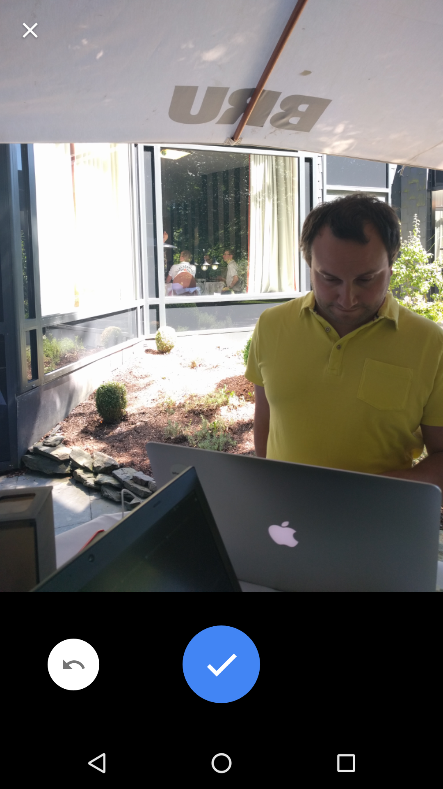
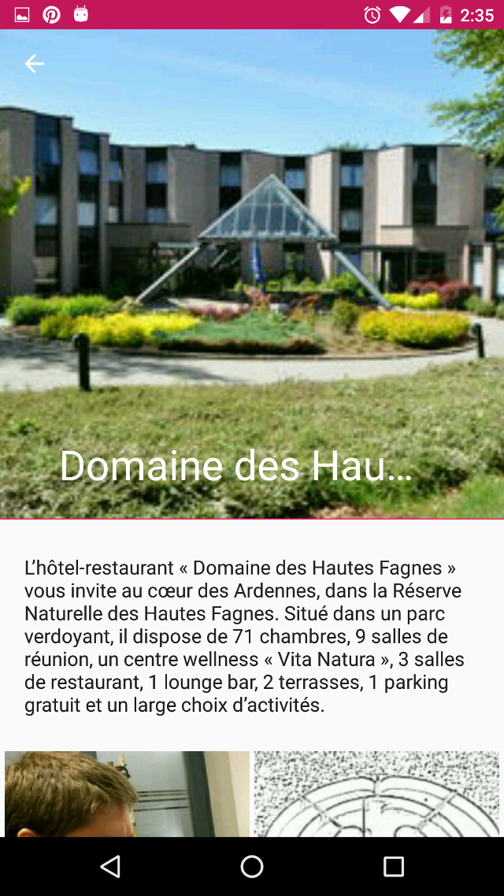
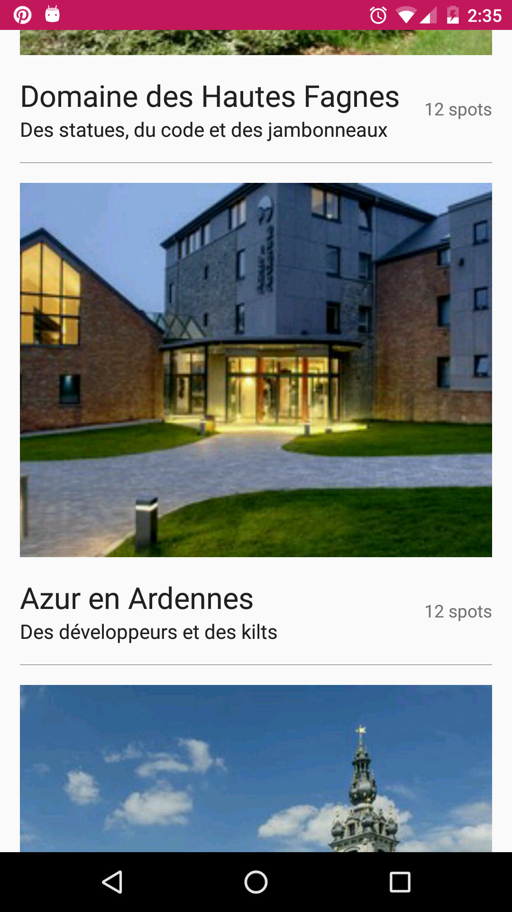
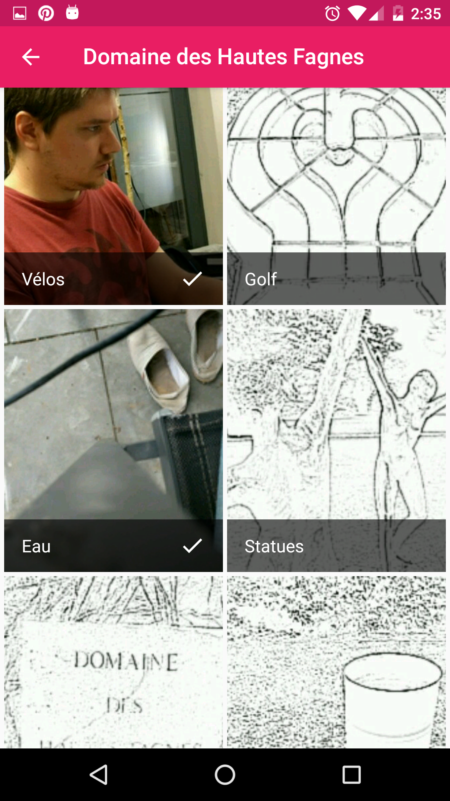
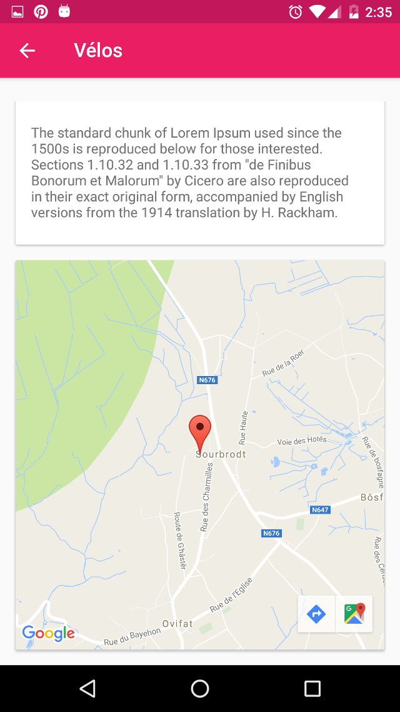
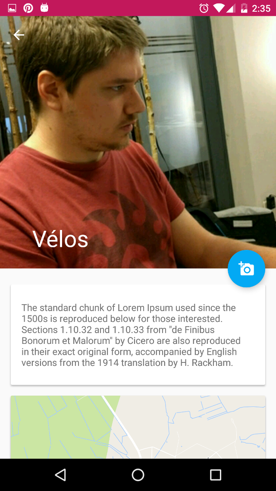

# Cliché

Equipe: Creative Monkeys

+ Aurélien Malisart
+ François Stephany
+ ~~Julien Fontaine (Papa)~~
+ Michaël Hoste

## Backend

    $ cd backend
    $ bundle
    $ rake app:reset
    $ rails server

## Mobile

    $ cd mobile
    $ npm i
    $ react-native start
    $ react-native run-ios
    $ react-native run-android

## Android native

The app uses the latest SDK and build tools (24). minSDKVersion: 21 (Lollipop)

Stack:

- Support libraries (24.1.1)
- Google Play Maps
- Retrofit
- RxJava
- Timber
- Glide
- MaterialDialogs

### Installation

	$ cd android-native/
	$ ./gradlew installDebug

### Screenshots

